# Augmentation Pipeline — Deep Dive

This document explains how image augmentation works in this project, from first principles up to the full pipeline. It is written for someone comfortable with Python who has not used Albumentations before.

---

## 1. What is Albumentations and why do we use it?

Albumentations is a library for **image augmentation** — the practice of generating new training images by applying random transformations to existing ones. The goal is to make the model robust to real-world variance: different lighting, camera angles, zoom levels, and backgrounds.

The key things to know before reading any code:

- Every augmentation is a **Transform object** (e.g. `A.ShiftScaleRotate`, `A.GaussianBlur`)
- Transforms are chained together using **`A.Compose([...])`**, which runs them in order
- Every transform has a **`p=` parameter** (probability), which controls whether it fires on any given image. `p=1.0` means always apply; `p=0.7` means apply 70% of the time, skip 30%
- You call the composed pipeline like a function, passing the image as a keyword argument:
  ```python
  result = transform(image=my_numpy_array)
  augmented_image = result['image']
  ```
- The image is always a **NumPy array** with shape `(H, W, 3)`, dtype `uint8`, pixel values 0–255
- The output is a **dict** — `result['image']` gives you the augmented array

### The `p=` parameter — visualized

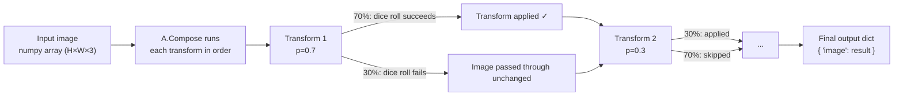

Each transform makes its own independent dice roll. In a single forward pass through the pipeline, some transforms will fire and some won't — this is what makes each augmented image unique.

---

## 2. The two augmentation contexts

This project uses augmentation in **two different places** with different goals:

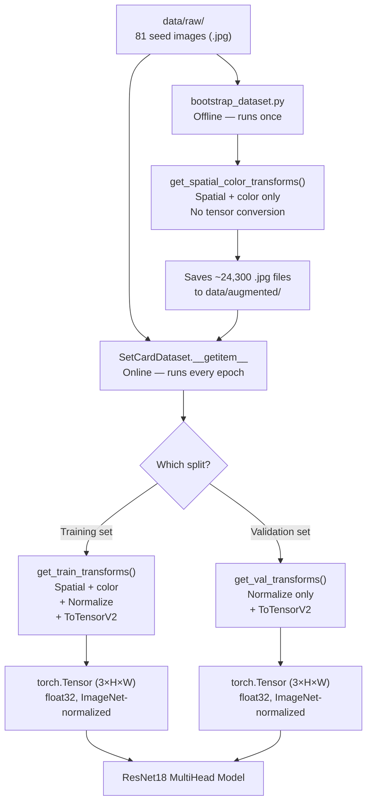

**Offline (bootstrap):** Run once before training. Takes each of the 81 seed images and generates ~300 variations, saving them to disk as `.jpg` files. Uses only spatial and color transforms — no tensor conversion, because the result is saved as an image file, not fed to a model.

**Online (training):** Runs every time `__getitem__` is called (i.e., every time the DataLoader fetches a sample). The loaded image is augmented on-the-fly, normalized, and converted to a PyTorch tensor. Validation images skip augmentation entirely — only normalization and tensor conversion are applied.

---

## 3. The three transform pipelines

There are three functions in `augmentations.py`. Here is exactly what each one does and why.

### 3.1 `get_spatial_color_transforms()`

```python
A.Compose([
    A.ShiftScaleRotate(..., p=0.7),
    AddRandomBackground(..., p=1.0),
    A.RandomBrightnessContrast(..., p=0.7),
    A.HueSaturationValue(..., p=0.7),
    A.GaussianBlur(..., p=0.3),
])
```

This is the **core augmentation recipe** — the transforms that simulate real-world variance. It produces a numpy array as output (no tensor conversion).

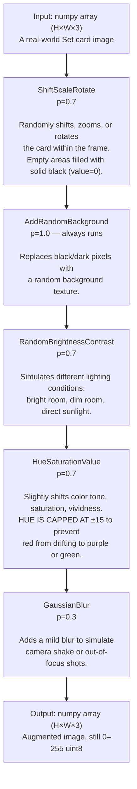

**Why this exact order?** Order matters. `ShiftScaleRotate` must run first because it introduces black padding around the card. `AddRandomBackground` must run second to replace that black padding with a texture — if it ran first, there would be nothing to replace yet.

### 3.2 `get_train_transforms()`

```python
A.Compose([
    get_spatial_color_transforms(),   # the recipe above, nested inside
    A.Normalize(mean=[0.485, 0.456, 0.406], std=[0.229, 0.224, 0.225]),
    ToTensorV2()
])
```

This wraps the spatial/color pipeline and adds two final steps required by PyTorch:

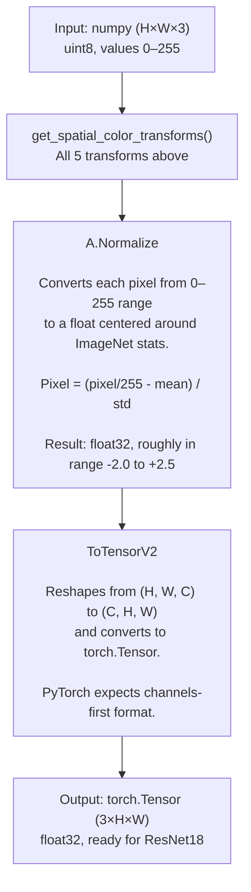

**Why normalize?** ResNet18 was pre-trained on ImageNet. The weights in its early layers were calibrated expecting inputs normalized with specific mean and standard deviation values. If we feed it raw 0–255 integers, the activations will be on the wrong scale and the pre-trained weights won't transfer well.

**Why `ToTensorV2`?** NumPy arrays are `(H, W, C)` — height first, channels last. PyTorch expects `(C, H, W)` — channels first. `ToTensorV2` handles this reshape. It also avoids an unnecessary copy (unlike the old `ToTensor`).

### 3.3 `get_val_transforms()`

```python
A.Compose([
    A.Normalize(mean=[0.485, 0.456, 0.406], std=[0.229, 0.224, 0.225]),
    ToTensorV2()
])
```

**No spatial or color augmentation.** The validation set must represent the model's performance on natural images — images the model hasn't seen before. If we augmented validation images, we'd be evaluating on a different distribution than what we trained on, and the metrics would be misleading.

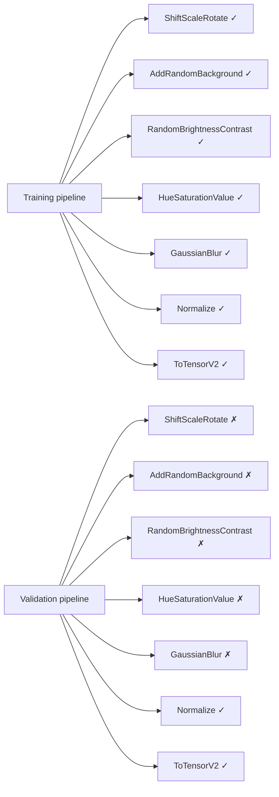

---

## 4. The `AddRandomBackground` custom transform — in detail

This is the only custom transform in the project. Albumentations lets you write your own by subclassing `A.ImageOnlyTransform` and implementing the `apply()` method.

The problem it solves: raw seed images have dark rounded corners (the card shape doesn't fill the whole rectangle), and after `ShiftScaleRotate` rotates the card, more dark/black area is introduced around the edges. A model trained on these would learn that "black borders = a Set card" — not a generalizable rule. This transform replaces those dark areas with varied backgrounds.

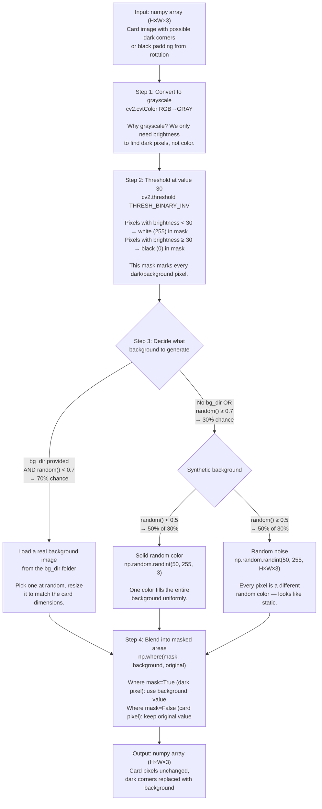

### The `np.where` blend — explained

`np.where(condition, x, y)` is like a per-pixel if/else:
- Where `condition` is `True` → use value from `x` (the background)
- Where `condition` is `False` → use value from `y` (the original image)

The mask is `True` at every dark pixel, so those get the background. The card itself (brighter pixels) keeps its original values. No pixels are "mixed" — it's a hard swap.

### The 70%/50% probability tree

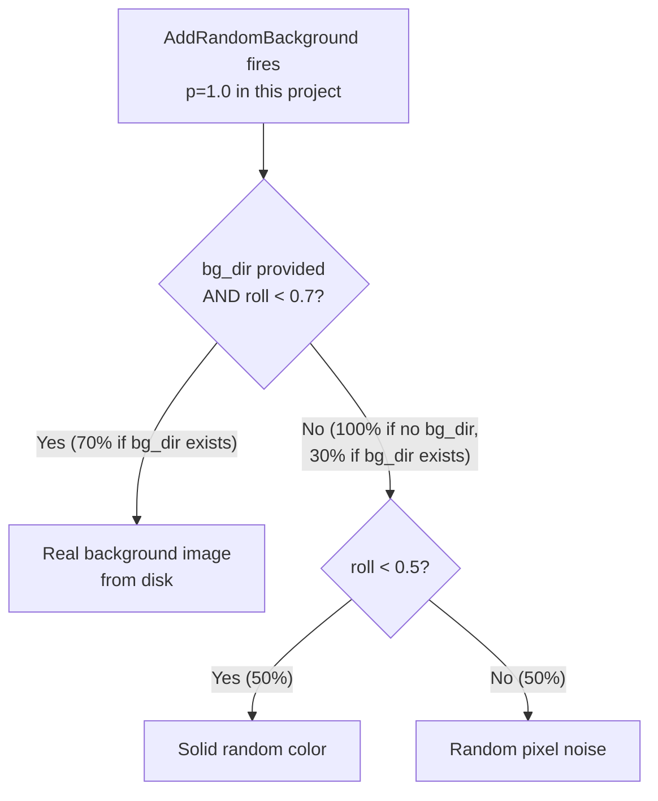

In our project, `bg_dir` is `None` in all current usages (no real background images are provided), so the real-image branch never fires. Every call picks either a solid color or noise with equal probability.

---

## 5. The HueSaturationValue constraint — why it matters

This is the most important design decision in the augmentation pipeline.

Set cards have three possible colors: **red**, **green**, and **purple**. These are the labels the model must predict. If augmentation shifts a red card's hue too far, it might start looking purple — corrupting the label without changing it.

Hue is measured on a 0–360° wheel:

```
        Yellow (~60°)
           |
Green (~120°) ——— Red (0°/360°)
           |
        Cyan (~180°)
           |
Blue (~240°) ——— Magenta (~300°)
           |
        Purple (~270°)
```

Red and purple are only ~90° apart. A `hue_shift_limit=15` means we allow at most a ±15° shift. This keeps red firmly in the red zone and purple firmly in the purple zone with a large safety margin.

If we used `hue_shift_limit=90` (a common default), a red card could become orange, yellow, or even greenish — the label "red" would be wrong.

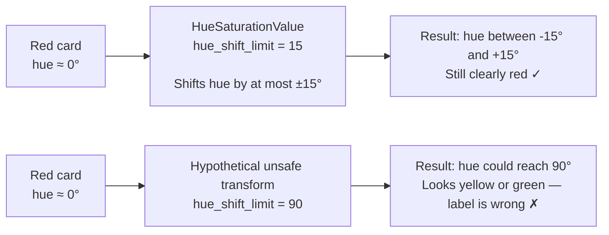

---

## 6. End-to-end data flow during training

This section walks through the complete chain — from calling `Trainer.fit()` all the way to a batch arriving at the model — explaining every layer of the machinery.

---

### 6.1 The four-layer stack

There are four components working together. Understanding who calls whom is essential before reading any of the code.

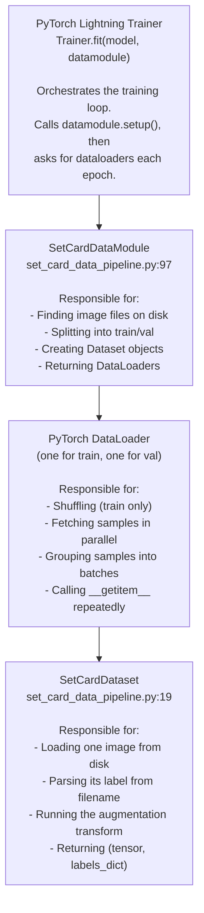

The DataLoader is the engine that drives the Dataset. It calls `__getitem__` on the Dataset repeatedly, collects the results, and stacks them into batches. The Trainer drives the DataLoader — it asks for the next batch, passes it to the model, computes the loss, and updates the weights.

---

### 6.2 `SetCardDataModule.setup()` — what runs before training starts

`setup()` is called once by the Trainer before the first epoch. It does three things:

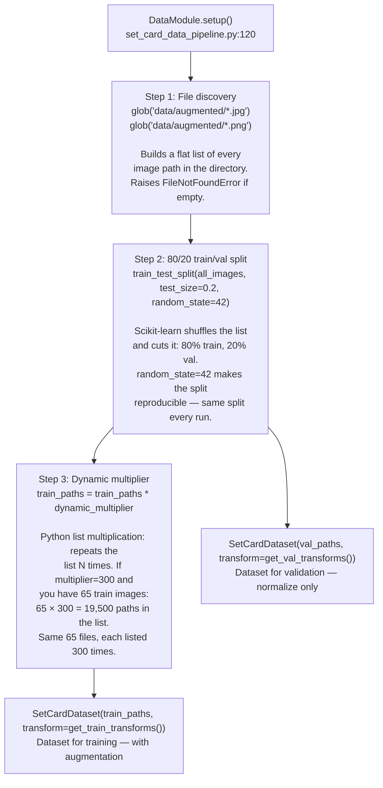

**The dynamic multiplier explained:**

The multiplier is a trick for when you're training on the 81 raw seed images directly (not the bootstrapped augmented set). Without it, one epoch would be only 65 training steps (81 × 0.8 = 65 images). That's too short — the model barely sees anything before the epoch ends and validation runs.

With `dynamic_multiplier=300`, the path list is `[img1, img2, ..., img65, img1, img2, ...]` — 300 repetitions. Each call to `__getitem__` loads the same file but runs a fresh random augmentation, producing a different image each time. So it's 19,500 iterations per epoch, each one a unique augmented view of the 65 training cards.

When using the bootstrapped `data/augmented/` folder (~24,000 files), the multiplier should be left at `1` — there are already enough unique files.

---

### 6.3 The DataLoader — how batching works

The DataLoader sits between the Dataset and the model. It controls how samples are fetched and assembled.

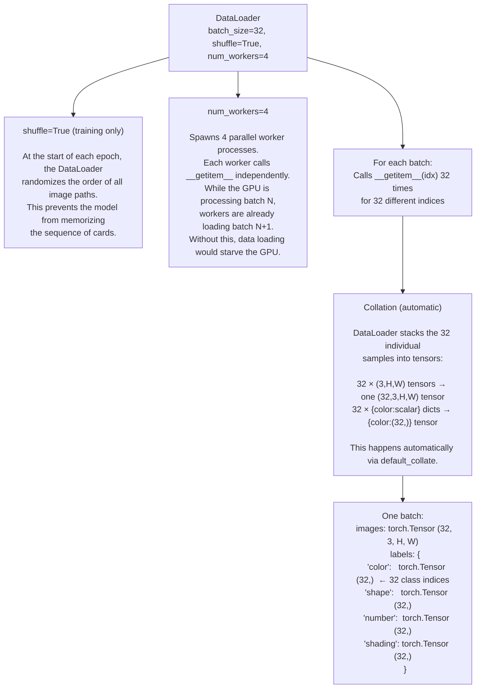

**Why `shuffle=False` for validation?** Validation order doesn't affect the results (we're just measuring accuracy, not updating weights), and a fixed order makes runs reproducible and easier to debug.

---

### 6.4 `SetCardDataset.__getitem__` — what happens for a single sample

This is the method the DataLoader calls 32 times to build one batch. Here is every line, explained:

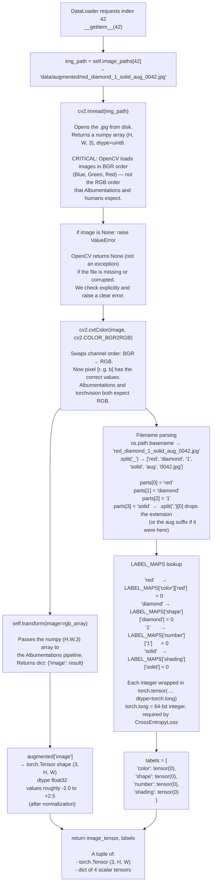

---

### 6.5 LABEL_MAPS — why integers, and why these specific values

```python
LABEL_MAPS = {
    'color':   {'red': 0, 'green': 1, 'purple': 2},
    'shape':   {'diamond': 0, 'squiggle': 1, 'oval': 2},
    'number':  {'1': 0, '2': 1, '3': 2},
    'shading': {'solid': 0, 'striped': 1, 'open': 2}
}
```

**Why integers?** PyTorch's `CrossEntropyLoss` (and `F1Score` metrics) require integer class indices, not strings. The model outputs a vector of 3 logits per head — index 0 means "class 0", index 1 means "class 1", etc. The label must be one of those indices so the loss can compare them.

**Why these specific integers?** The mapping is arbitrary — what matters is consistency. `red=0` just means "red is class zero in the color head." As long as every sample with a red card maps to `0`, and the model learns to output its highest logit at index `0` for red cards, the classifier is correct.

**Why `dtype=torch.long`?** `CrossEntropyLoss` requires the target to be a 64-bit integer tensor (`torch.long`). If you pass a float or a 32-bit int, PyTorch will raise a runtime error. This is enforced at label creation time so the error surfaces early.

---

### 6.6 What a complete batch looks like — shapes at every stage

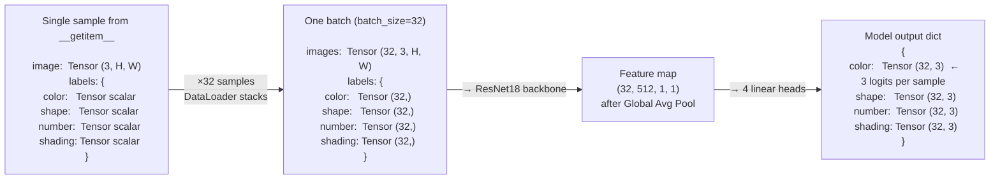

The `(32, 3)` output means: for each of the 32 images in the batch, the model produced 3 raw scores (logits). The highest score is the predicted class. `CrossEntropyLoss` compares these logits against the integer label (e.g., `0` for red) to compute the loss.

---

### 6.7 Full picture — one training step from disk to loss

```mermaid
flowchart TD
    DISK["data/augmented/\n~24,300 .jpg files on disk"]

    DISK --> SETUP["DataModule.setup()\nDiscover files → 80/20 split → apply multiplier\nCreate train Dataset + val Dataset"]

    SETUP --> EPOCH["Start of epoch\nDataLoader shuffles training indices"]

    EPOCH --> WORKERS["4 parallel worker processes\nEach worker calls __getitem__ independently"]

    WORKERS --> GETITEM["__getitem__(idx) — per sample:\n1. cv2.imread → BGR numpy\n2. BGR → RGB\n3. filename.split('_') → label integers\n4. transform(image=array) → Tensor (3,H,W)\n5. return (tensor, labels_dict)"]

    GETITEM --> COLLATE["DataLoader collation\nStack 32 samples:\nimages → (32,3,H,W)\nlabels → 4× (32,) tensors"]

    COLLATE --> FORWARD["model.training_step(batch)\nForward pass through ResNet18\nOutput: 4 × (32,3) logit tensors"]

    FORWARD --> LOSS["Combined loss\nloss = CrossEntropy(color_logits, color_labels)\n     + CrossEntropy(shape_logits, shape_labels)\n     + CrossEntropy(number_logits, number_labels)\n     + CrossEntropy(shading_logits, shading_labels)"]

    LOSS --> BACK["loss.backward()\nAdamW.step()\nWeights updated"]

    BACK --> NEXT["Next batch →\nrepeat until epoch ends"]

    NEXT --> VAL["Validation\nSame flow, but:\n- No shuffle\n- get_val_transforms() only\n- No weight updates"]
```

---

## 7. Known gap: missing Resize step

Currently neither `get_train_transforms()` nor `get_val_transforms()` includes a `Resize(224, 224)` step. ResNet18 expects 224×224 input. If the raw images are a different size, PyTorch will either crash or silently produce wrong results (depending on whether the sizes happen to work with the convolution strides).

This is tracked as **Issue #1**. The fix is to add `A.Resize(224, 224)` as the first step in both pipelines.
