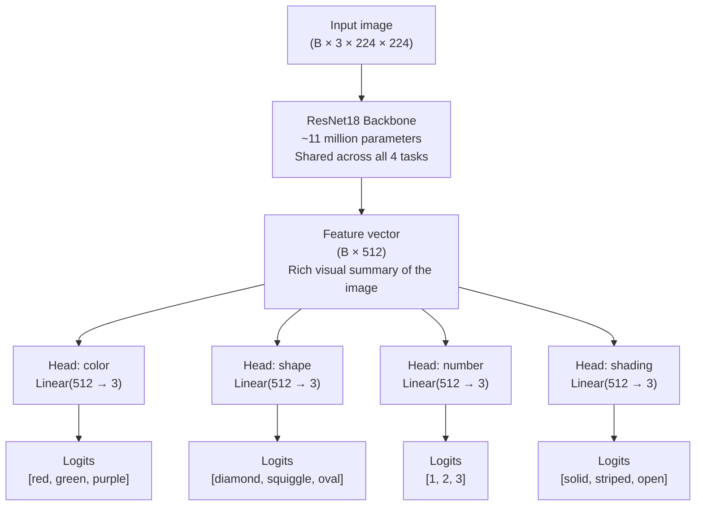
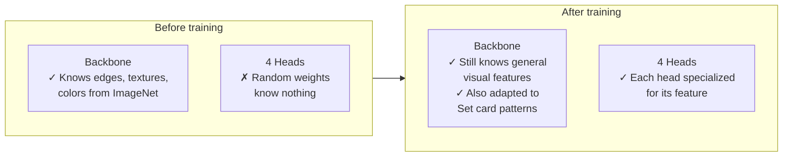
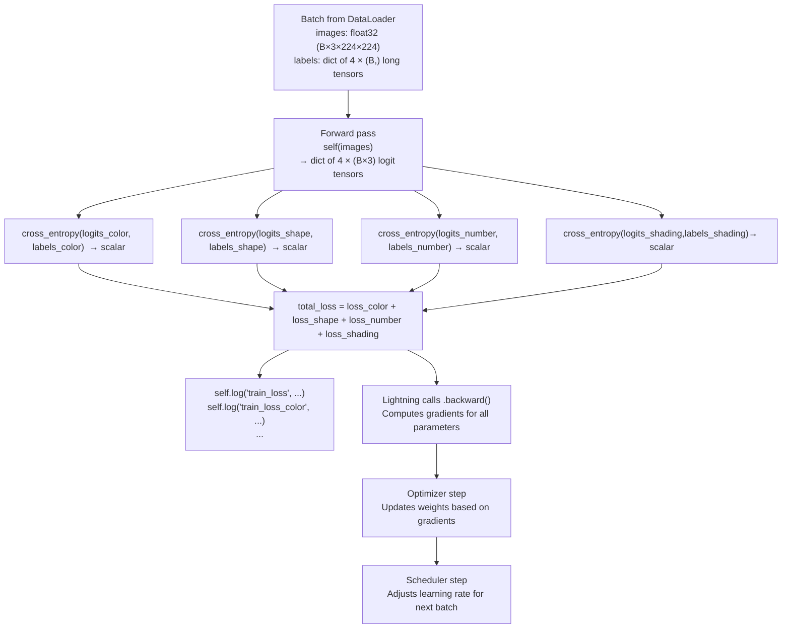
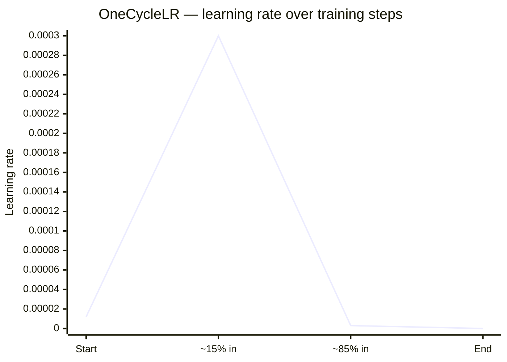
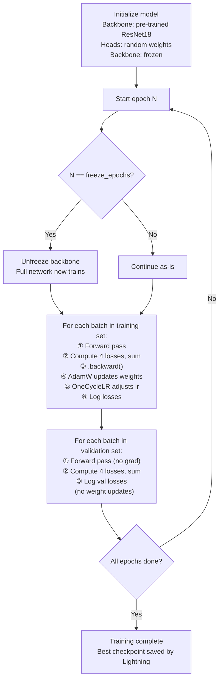

# MultiHeadResNet — How Training Works

This document explains how the `MultiHeadResNet` model is trained, from the high-level idea down to what happens on each batch. It assumes you know what a neural network is and roughly what "training" means, but not necessarily the details of transfer learning, multi-task learning, or learning rate schedules.

---

## 1. The core idea: one model, four tasks

A Set card has four independent features: **color**, **shape**, **number**, and **shading**. Each has three possible values.

The naive approach would be to train four completely separate classifiers. Instead, we train **one model with four output heads**. The intuition: all four tasks need to understand the same visual information — what shape is drawn, what color it is, how many of them there are. There is no reason to do that visual work four times.



The backbone does the heavy lifting (understanding the image). Each head is tiny — a single linear layer — and specializes in one question. This design is called **Multi-Task Learning (MTL)**.

---

## 2. Transfer learning: why we don't train from scratch

The backbone is **ResNet18 pre-trained on ImageNet** — a dataset of 1.28 million photographs across 1,000 categories. After that training, the backbone's layers have learned to detect low-level patterns (edges, corners, textures, color gradients) that are useful for almost any image recognition task.

We inherit all of that for free. Instead of starting from random noise, we start from a backbone that already "knows how to look at images" and just teach it to look at Set cards.

The four heads are the only part that starts from scratch (random initialization), because nothing in ImageNet maps to "how many symbols are on this card."



---

## 3. The freeze-then-unfreeze strategy

There is a problem with starting from pre-trained weights and random heads: the head gradients are initially very large and noisy (the heads know nothing, so every prediction is wildly wrong). If we let those gradients flow into the backbone immediately, they corrupt the carefully learned ImageNet features.

The fix: **freeze the backbone** for the first few epochs. Only the heads learn. Once they produce reasonable predictions, the gradients are much smaller and more informative — at that point it is safe to unfreeze the backbone and fine-tune everything together.

```mermaid
gantt
    title Training phases (default: freeze_epochs = 5)
    dateFormat  X
    axisFormat Epoch %s

    section Backbone
    Frozen — no gradient updates    :0, 5
    Unfrozen — fine-tuning          :5, 20

    section Heads (color, shape, number, shading)
    Training from random init       :0, 5
    Continuing to train             :5, 20
```



In code this is handled by `on_train_epoch_start()`, a Lightning hook that runs automatically at the start of every epoch. When `current_epoch == freeze_epochs`, it calls `_unfreeze_backbone()` and prints a message.

---

## 4. One training step, step by step

Lightning calls `training_step(batch, batch_idx)` once per batch. Here is what happens inside it:



### What is CrossEntropyLoss?

CrossEntropyLoss answers: *how surprised is the model by the correct answer?*

The model outputs three raw scores (logits) for each feature — one per class. CrossEntropyLoss converts these to probabilities internally and then measures how much probability mass was assigned to the correct class. If the model is confident and right, the loss is near 0. If the model is confident and wrong, the loss is large.

### Why sum the four losses?

Summing produces a single scalar, which is what `.backward()` needs to compute gradients. The sum means: *update the weights in whatever direction reduces all four errors simultaneously*. Because all four tasks have the same number of classes (3) and similar difficulty, equal weighting (summing, not averaging) works well.

---

## 5. The optimizer: AdamW

After `.backward()` computes how much each weight contributed to the error, the optimizer decides how much to change each weight.

**AdamW** does two things that plain gradient descent doesn't:

1. **Adaptive learning rates**: it tracks the history of each parameter's gradients. Parameters that have been changing a lot get smaller updates (they are already moving); parameters that have barely moved get larger updates (they haven't been explored yet). This makes training faster and more stable.

2. **Weight decay (L2 regularization)**: it adds a small penalty for having large weights. This prevents any single neuron from becoming too dominant and helps the model generalize to images it hasn't seen.

```
weight_update = -lr × (gradient / gradient_history) - weight_decay × current_weight
                 ↑                                      ↑
         adaptive gradient step              regularization nudge toward zero
```

Hyperparameters used: `lr=3e-4`, `weight_decay=1e-2`.

---

## 6. The learning rate schedule: OneCycleLR

The **learning rate** controls how large each parameter update is. Too large: training is chaotic and diverges. Too small: training is slow and gets stuck in local minima.

OneCycleLR solves this by varying the learning rate over the course of training in three phases:



| Phase | What happens | Why |
|---|---|---|
| **Warm-up** (~30% of steps) | LR ramps from ~lr/25 up to max_lr | Lets the model explore the loss landscape without getting stuck immediately |
| **Cool-down** (~70% of steps) | LR decays from max_lr all the way down to ~lr/1e4 | Fine-tunes: smaller steps allow the model to settle into a good minimum |

The key advantage in short training runs (20–30 epochs) is that the warm-up phase aggressively escapes bad starting points, and the cool-down phase achieves the precision of a very low learning rate without having to wait many more epochs.

`OneCycleLR` must step **once per batch** (not once per epoch), which is why the config returns `interval: 'step'`. The total number of steps is computed automatically by Lightning via `trainer.estimated_stepping_batches`.

---

## 7. The full training loop

Putting it all together, here is what happens across the full training run:



**Validation** uses the same loss formula but no `.backward()` is called — it is purely for measuring how well the model generalises to images it has not been trained on. Because the validation pipeline applies no augmentation (only resize + normalize), the val loss is a fair, stable comparison across epochs.

---

## 8. What the logged metrics mean

| Metric key | Logged when | What it tells you |
|---|---|---|
| `train_loss` | Every step + epoch end | Combined loss across all 4 heads on training data. Should decrease over time. |
| `train_loss_color` | Epoch end | How wrong the color head is on training data. |
| `train_loss_shape` | Epoch end | How wrong the shape head is on training data. |
| `train_loss_number` | Epoch end | How wrong the number head is on training data. |
| `train_loss_shading` | Epoch end | How wrong the shading head is on training data. |
| `val_loss` | Epoch end | Combined loss on unseen validation images. If this rises while train_loss falls, the model is overfitting. |
| `val_loss_*` | Epoch end | Per-feature breakdown of val loss. Useful for diagnosing which features are hardest to learn. |

A healthy training run shows both `train_loss` and `val_loss` decreasing together. A large gap between them (train much lower than val) indicates overfitting.
