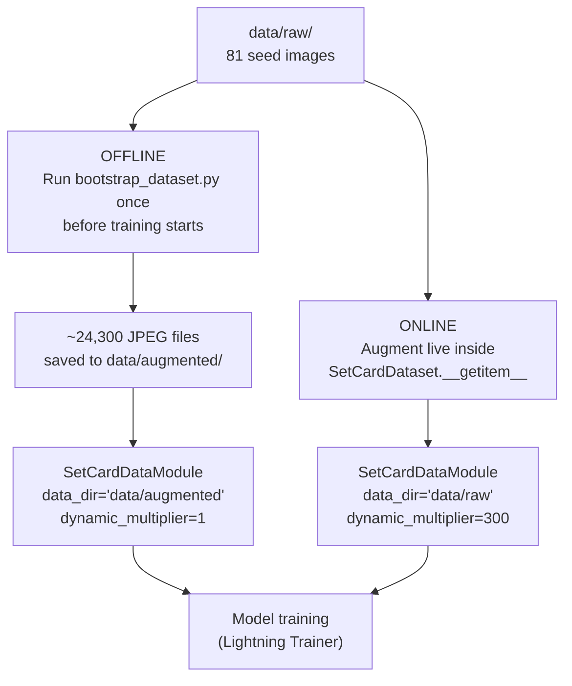
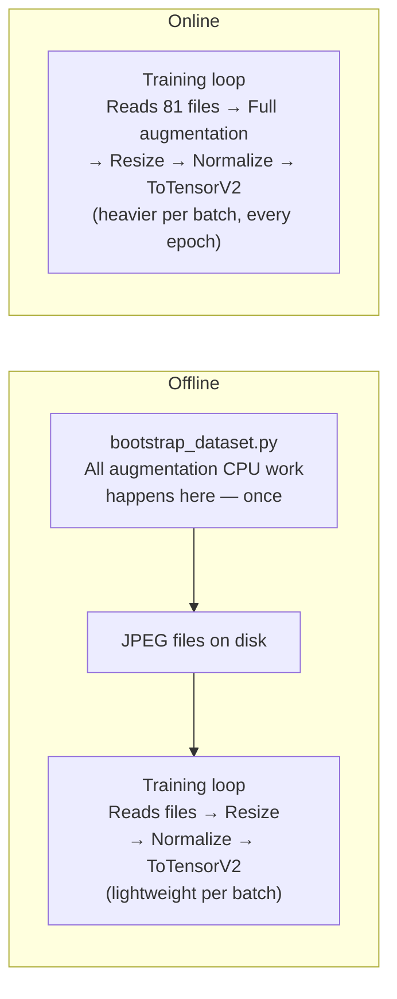
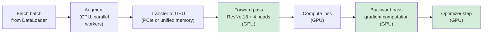
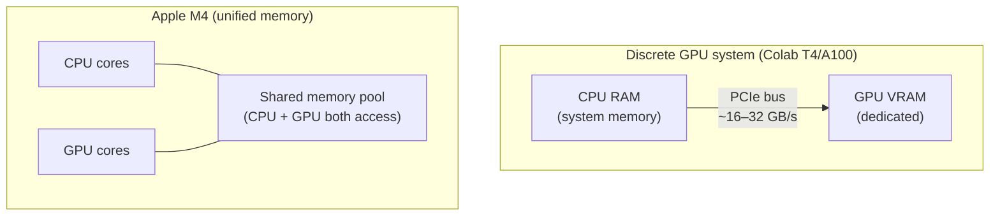
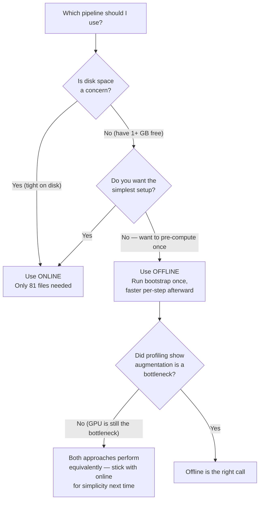
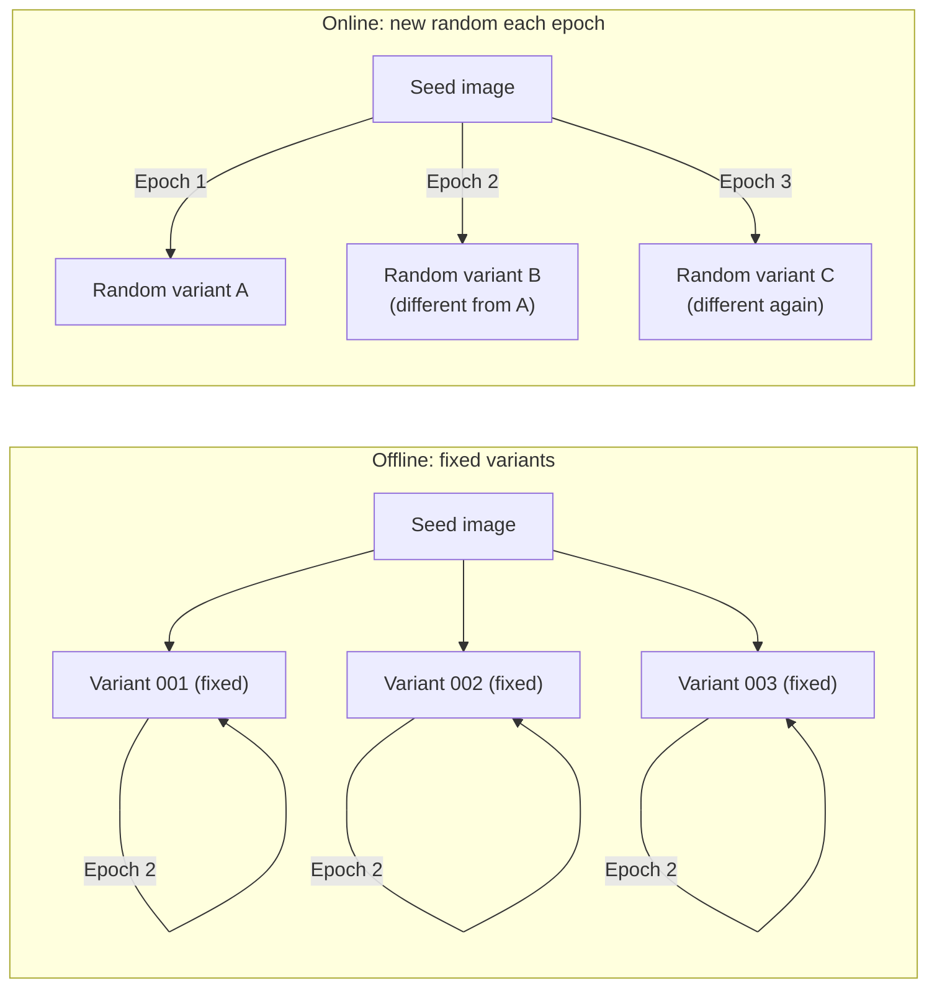

# Offline vs Online Augmentation — Decision Guide

This document explains the two ways to use the augmentation pipeline during training, when each makes sense, and how to configure the code for each approach.

---

## 1. What are offline and online augmentation?

The augmentation pipeline (`get_spatial_color_transforms`) can run in two places: **before training** (offline) or **during training** (online). Both ultimately feed the same augmented images to the model — the difference is *when* the augmentation work happens.



In both cases the model sees the same volume of augmented data — approximately 24,300 training images per epoch (81 seeds × 300 variants × 0.8 train split). Only the source and timing differ.

---

## 2. How the code differs

### Offline setup

```bash
# Step 1: run once to generate the augmented dataset
python -m src.data.bootstrap_dataset \
    --raw_dir data/raw \
    --augmented_dir data/augmented \
    --augmentations 300

# Step 2: point DataModule at the pre-generated files
```

```python
dm = SetCardDataModule(
    data_dir='data/augmented',
    batch_size=32,
    num_workers=4,
    dynamic_multiplier=1,   # files already expanded on disk
)
```

### Online setup

```python
# No bootstrap step needed — just point at the 81 seed images
dm = SetCardDataModule(
    data_dir='data/raw',
    batch_size=32,
    num_workers=4,
    dynamic_multiplier=300, # repeat each seed 300x per epoch
)
```

The `dynamic_multiplier` works by list multiplication in `SetCardDataModule.setup()`:

```python
train_paths = train_paths * self.dynamic_multiplier
# 65 train seeds × 300 = 19,500 items in the epoch
```

Each repeated path produces a *different* augmented image because `get_train_transforms()` randomizes every call.

---

## 3. Where each approach spends its compute



**Offline**: heavy CPU work is paid once upfront. Each training step does minimal work (disk read + normalize + tensor).

**Online**: heavy CPU work is paid every single batch of every epoch. The same augmentation that bootstrap ran 300× total per seed is now run 300× per seed *per epoch restart* — except in practice each epoch is a new random pass, which is exactly what you want.

---

## 4. Is disk IO a bottleneck?

In general, disk IO is one of the most common training bottlenecks in ML — but **not for this project**, for two reasons:

### Dataset size vs available RAM

| Pipeline | Files | Total size | Fits in 16 GB RAM? |
|---|---|---|---|
| Online | 81 files | ~3 MB | Yes — cached after the first epoch in seconds |
| Offline | ~24,300 files | ~700 MB | Yes — fully cached within 1–2 epochs |

Once the OS loads files into its page cache (RAM), subsequent reads bypass the disk entirely. For this dataset, the cache fills on the very first epoch and stays warm for the rest of training.

### SSD read speed

An M4 MacBook Air has an NVMe SSD capable of ~3–5 GB/s sequential reads. Even the offline 700 MB dataset would take less than 1 second to read cold. Disk IO would only become a real constraint at hundreds of GBs (e.g., ImageNet, video datasets).

---

## 5. Speed comparison

For this project, the dominant cost is the **GPU forward and backward pass**, not augmentation or disk IO. The difference between offline and online is small in practice.

### What actually drives training time



The green steps (forward + backward + optimizer) dominate. With `num_workers >= 4`, the CPU augmentation work runs in parallel and keeps the GPU continuously fed — the GPU never has to wait for augmentation to finish.

### Rough training time estimates

For 20 epochs on ~19,000 training images, batch size 32:

| Hardware | Throughput | Per epoch | 20 epochs |
|---|---|---|---|
| MacBook Air M4 (MPS) | ~150–300 img/s | 1–2 min | **20–40 min** |
| Colab T4 (free tier) | ~800–1,500 img/s | 15–45 sec | **5–15 min** |
| Colab A100 (Pro) | ~3,000–5,000 img/s | 5–15 sec | **2–5 min** |

These estimates apply to both offline and online. The difference between them is a rounding error compared to the hardware gap.

---

## 6. The M4 unified memory advantage

The MacBook Air M4 has a hardware characteristic that makes online augmentation unusually efficient: **unified memory** — the CPU and GPU share the same physical memory pool.



On discrete GPU systems, augmented tensors travel from CPU RAM to GPU VRAM over the PCIe bus — a real transfer cost. On M4, the augmented tensor created by the CPU is already in the same memory space the GPU reads from. There is no transfer. This partially offsets the cost of running augmentations live on the CPU.

---

## 7. Decision guide



### Summary table

| | Offline | Online |
|---|---|---|
| Run `bootstrap_dataset.py`? | Yes, once | No |
| `data_dir` | `data/augmented` | `data/raw` |
| `dynamic_multiplier` | `1` | `300` |
| Extra disk usage | ~700 MB | None |
| Setup steps | 2 (bootstrap + train) | 1 (train) |
| Speed difference | Marginal | Marginal |
| Variety per epoch | Fixed — same 24,300 files every epoch | True random — new augmentation per epoch |
| Best for | Very slow augmentation or huge datasets | Everything else |

### Recommendation for this project

**Use online.** The dataset is tiny, the hardware can keep up, and online augmentation produces strictly more varied training data (a different random augmentation every epoch rather than the same 300 fixed variants repeated forever). Only switch to offline if profiling shows the CPU is starving the GPU.

---

## 8. One subtle advantage of online: true randomness per epoch

There is one qualitative reason to prefer online beyond convenience. With offline augmentation, each seed image maps to exactly 300 fixed variants — and the model will see the same 300 images every single epoch. With online, the model sees a freshly randomized variant every time it encounters a seed. Over 20 epochs, it effectively sees 20× more variety.



For a dataset this small (81 seeds), this extra variety meaningfully reduces the chance of the model memorizing specific augmented images rather than learning general features.
